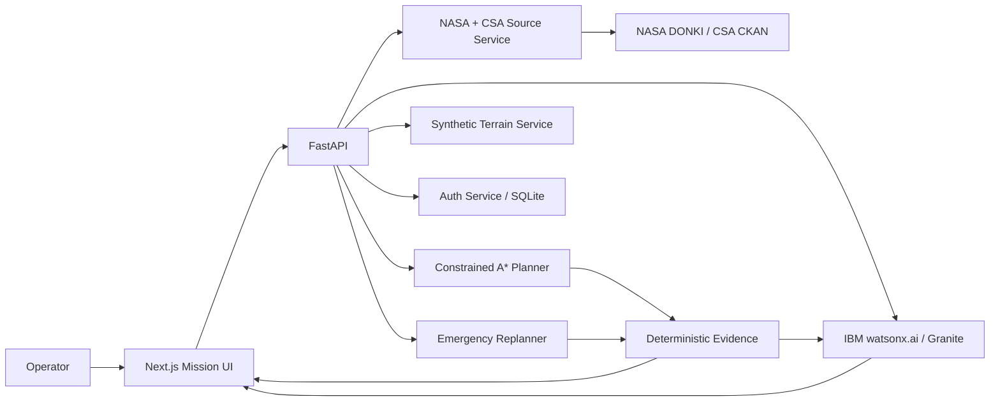

# LunaGuard
## Explainable Resilient Autonomy for Lunar Missions

> **AI Builders Challenge with IBM Bob — August 2026: Advance Space Exploration with AI**

LunaGuard is a full-stack lunar mission decision-support platform. It plans rover routes, compares energy/risk/time trade-offs, simulates mid-mission failures, replans from the rover's live position, keeps an operator-readable decision timeline, and uses **IBM watsonx.ai + Granite** to turn deterministic mission evidence and authoritative NASA / Canadian Space Agency source material into grounded mission intelligence.

**IBM Bob was used as the primary development tool.** LunaGuard is a prototype for simulation and decision support, not a certified flight system.

## Why LunaGuard is different

Most route demos stop at `start → destination`. LunaGuard demonstrates a complete resilient-autonomy loop:

**plan → compare → explain → authorize → simulate → fail → reassess → recover → audit**

The safety-critical boundary is deliberate: **Granite explains the decision; it does not invent the physics.** Route geometry, energy, slope, hazard, viability, and mission-success metrics are computed deterministically by the backend.

## Competition-ready pages

| Page | Judge-visible capability |
|---|---|
| **Dashboard** | Executive mission view, platform architecture, IBM AI status, quick access to each capability |
| **Mission Planner** | Original LunaGuard terrain planner with FASTEST / LOWEST_ENERGY / SAFEST trade studies, route evidence, execution and emergency recovery |
| **Mission Timeline** | NASA-style audit trail for planning, operator actions, AI decisions, anomalies, telemetry, and recovery events |
| **Digital Twin Lab** | End-to-end simulated traverse with live telemetry, dynamic failure injection, real backend replanning, and post-recovery completion |
| **3D Lunar Globe** | Interactive lunar sphere with toggleable topography/relief/illumination/grid/mission-marker visual layers and explicit provenance labels |
| **AI Mission Copilot** | IBM Granite on watsonx.ai, grounded in listed NASA LRO/LOLA, NASA DONKI, and CSA rover-analogue sources; deterministic fallback if cloud AI is unavailable |
| **Data Sources** | Source status, provenance, limitations, and the path from synthetic demo terrain to mission-grade datasets |
| **Login / Profile** | Local prototype accounts plus optional Google Identity Services sign-in; persistent backend sessions |

## Judging criteria map

| Criterion | LunaGuard evidence |
|---|---|
| **Technical Execution** | Next.js + TypeScript frontend, FastAPI backend, weighted A* route planning, deterministic energy/risk constraints, emergency replanning, digital twin, source-grounded AI, SQLite auth, Docker, typed API adapters |
| **Innovation** | Explainable resilient autonomy rather than a single-path demo: failure injection, recovery, audit timeline, and a grounded mission copilot in one platform |
| **Challenge Fit** | Directly supports lunar mission planning, rover safety, decision support, anomaly response, and translation of complex space data into actionable guidance |
| **Feasibility** | Hard safety constraints remain deterministic; AI is bounded to narration/retrieval; cloud dependencies degrade gracefully; real data sources are separated from synthetic demo data |
| **Real-World Impact** | Architecture can evolve toward validated lunar DEM ingestion, telemetry streams, mission audit storage, uncertainty models, and role-based mission operations |

See [`docs/JUDGING.md`](docs/JUDGING.md) for the detailed evidence map and [`docs/DEMO_SCRIPT.md`](docs/DEMO_SCRIPT.md) for a three-minute judge demo.

---

## Start in Windows

1. Open **Docker Desktop** and wait for the engine to be running.
2. Open PowerShell in the extracted LunaGuard folder.
3. Run:

```powershell
docker compose up -d --build
docker compose ps
```

Then open:

- LunaGuard: `http://localhost:3000`
- FastAPI docs: `http://localhost:8000/docs`
- Backend health: `http://localhost:8000/health`

You can also double-click `START_LUNAGUARD.cmd`.

Stop with:

```powershell
docker compose down
```

## Enable live IBM Granite

Copy `.env.example` to `.env` and set:

```env
WATSONX_API_KEY=YOUR_IBM_CLOUD_API_KEY
WATSONX_PROJECT_ID=YOUR_WATSONX_PROJECT_ID
WATSONX_URL=https://us-south.ml.cloud.ibm.com
WATSONX_MODEL_ID=ibm/granite-3-3-8b-instruct
```

Then rebuild:

```powershell
docker compose down
docker compose up -d --build
```

The UI visibly reports whether the response came from **watsonx / Granite** or the **offline-safe deterministic fallback**.

## Optional live NASA + Google configuration

NASA DONKI uses `NASA_API_KEY`. `DEMO_KEY` is supplied by default for development, so no secret is required for the basic demo.

Optional Google sign-in requires a Google OAuth Web client ID:

```env
GOOGLE_CLIENT_ID=YOUR_GOOGLE_WEB_CLIENT_ID
```

Configure `http://localhost:3000` as an authorized JavaScript origin in the Google Cloud OAuth client. Local email/password accounts work without Google configuration.

---

## Core mission engine

LunaGuard generates a deterministic 100×100 synthetic lunar-style terrain grid for the reproducible judge demo. The planner then produces three constrained A* profiles:

- `FASTEST`
- `LOWEST_ENERGY`
- `SAFEST`

Every profile must respect the rover's hard traversability and maximum-slope limits. The backend computes:

- distance and estimated travel time
- energy required and projected battery reserve
- maximum slope encountered
- average hazard and normalized risk
- mission-success score
- viability, warnings, and hard-constraint violations

The emergency service can then reassess a mission after:

- battery degradation
- reduced mobility / slope capability
- terrain obstruction
- communication-delay scenarios supported by the API model

The **Digital Twin Lab** uses these real planning/reassessment endpoints: it does not fake the route decision in the browser.

## IBM AI architecture

```text
NASA / CSA source catalog ───────────────┐
                                         │
Mission context ─────────────────────────┼─> Grounded prompt
                                         │        │
Deterministic route evidence ────────────┘        ▼
                                         IBM watsonx.ai
                                      Granite 3.3 8B
                                             │
                                             ▼
                                      Mission narration
                                             │
                       deterministic metrics remain authoritative
```

Two distinct AI experiences are exposed:

1. **Mission Brief** — narrates a selected route's deterministic evidence.
2. **Mission Copilot** — answers operator questions using mission context plus the listed NASA/CSA source summaries. It is explicitly instructed to distinguish source facts from inference and not invent telemetry or safety numbers.

If watsonx is unavailable, both workflows degrade to deterministic fallback behavior so the route planner remains functional.

## Data provenance

The current route-planning terrain is **synthetic** and is deliberately labeled as such. The 3D globe contains generated visual proxies for lunar topography/relief/illumination; those pixels are **not** claimed to be raw NASA imagery.

The Copilot source layer references authoritative public material, including:

- NASA Lunar Reconnaissance Orbiter / LOLA science and data
- NASA LRO data products / Planetary Data System pathways
- NASA DONKI space-weather API
- Canadian Space Agency Lunar Exploration Analogue Deployment rover data
- best-effort live CSA open-data search

See [`docs/RESPONSIBLE_AI.md`](docs/RESPONSIBLE_AI.md) and the in-app **Data Sources** page.

## Authentication

The hackathon prototype includes:

- local registration and login
- PBKDF2-HMAC-SHA256 password hashing with per-user salts
- random bearer sessions stored by hash in SQLite
- optional Google Identity Services login
- persistent Docker volume for the auth database

For a production deployment, use a managed identity provider, secure HTTP-only cookies, CSRF protections, rate limiting, account recovery, MFA, and centralized audit storage.

## Architecture



More detail: [`docs/ARCHITECTURE.md`](docs/ARCHITECTURE.md).

## Repository structure

```text
lunaguard/
├── backend/                 FastAPI planning, recovery, AI, auth and source services
├── frontend/                Next.js multi-page mission operations console
├── data/                    deterministic demo data assets
├── demo/                    demo support material
├── docs/                    judging, architecture, API, responsible AI, Bob usage
├── scripts/                 verification scripts
├── docker-compose.yml
├── START_LUNAGUARD.cmd
└── README.md
```

## Submission checklist

- [ ] Run the full judge demo without errors.
- [ ] Configure watsonx so the Copilot visibly reports **Granite live** for the recorded video.
- [ ] Capture Dashboard, Planner, Digital Twin recovery, Timeline, Copilot citations, and Data Sources screenshots.
- [ ] Add a public GitHub URL.
- [ ] Add the public ≤3 minute demo video.
- [ ] Explain specifically how IBM Bob was used; see [`docs/BOB_USAGE.md`](docs/BOB_USAGE.md).
- [ ] Complete the required IBM SkillsBuild activity.
- [ ] Do not commit `.env` or secrets.

## License

MIT — see [`LICENSE`](LICENSE).
