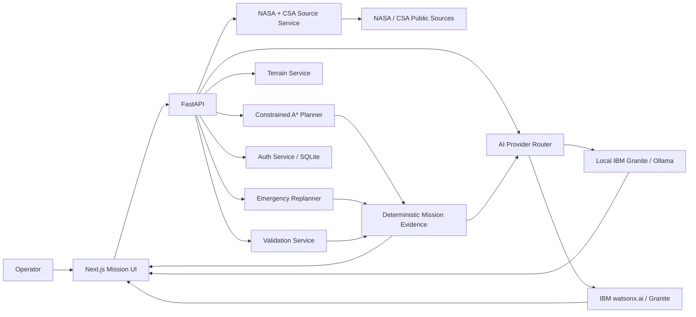

# LunaGuard

## Explainable Resilient Autonomy for Lunar Missions

> **AI Builders Challenge with IBM Bob — August 2026: Advance Space Exploration with AI**

LunaGuard is a full-stack lunar mission decision-support platform. It plans rover routes, compares energy/risk/time trade-offs, simulates mid-mission failures, replans from the rover's live position, keeps an operator-readable decision timeline, and uses **IBM Granite** through local inference or **IBM watsonx.ai** to turn deterministic mission evidence and authoritative NASA / Canadian Space Agency source material into grounded mission intelligence.

**IBM Bob was used as the primary development tool.** LunaGuard is a prototype for simulation and decision support, not a certified flight system.

## Why LunaGuard is different

Most route demos stop at `start → destination`. LunaGuard demonstrates a complete resilient-autonomy loop:

**plan → compare → explain → authorize → simulate → fail → reassess → recover → validate → audit**

The safety-critical boundary is deliberate: **Granite explains the decision; it does not invent the physics.** Route geometry, energy, slope, hazard, viability, and mission-success metrics are computed deterministically by the backend.

LunaGuard also separates three kinds of evidence so operators can understand what they are looking at:

* **Mission evidence** — deterministic route, energy, slope, hazard, and recovery calculations.
* **Source evidence** — NASA / Canadian Space Agency material used for scientific and operational context.
* **AI inference** — IBM Granite-generated explanation grounded in the supplied mission and source evidence.

## Latest 2026 updates

The latest LunaGuard release expands the original mission-planning platform while keeping the core deterministic safety architecture intact.

### New platform capabilities

* **Dark and Light Mode** — operators can switch between mission-control dark mode and a high-readability light interface.
* **Improved typography and spacing** — larger text, cleaner card spacing, reduced visual crowding, and improved responsive layouts.
* **Validation Lab** — runs repeatable mission-planning and recovery scenarios and reports measured route viability, hard-constraint violations, battery reserve, risk, latency, and recovery performance.
* **Local IBM Granite support** — LunaGuard can use IBM Granite locally through Ollama without requiring a paid cloud inference service.
* **IBM watsonx.ai support** — cloud Granite inference remains available when watsonx credentials are configured.
* **Question-aware Copilot fallback** — when Granite is unavailable, the Copilot provides mission-aware deterministic responses instead of returning the same generic answer for unrelated questions.
* **Route-aware AI explanations** — the Copilot can explain the most recently planned FASTEST, LOWEST_ENERGY, or SAFEST route using real LunaGuard metrics.
* **Evidence boundary** — the UI visibly distinguishes deterministic mission evidence, NASA/CSA source evidence, and AI-generated interpretation.
* **AI numeric safety guard** — mission-critical values remain authoritative in LunaGuard's deterministic backend rather than being invented by the language model.
* **NASA API support** — LunaGuard supports a private `NASA_API_KEY` through `.env`, with `DEMO_KEY` available as a development fallback.
* **NASA LRO / LOLA pathway** — the architecture supports lunar elevation products from NASA's Lunar Reconnaissance Orbiter / LOLA data ecosystem while clearly identifying which terrain is synthetic and which data is externally sourced.
* **Improved Digital Twin workflow** — mission failure, reassessment, recovery, telemetry, and completion are presented as one continuous operational story.
* **Enhanced IBM Bob integration** — project-level Bob/MCP tooling can inspect LunaGuard health, mission AI status, sources, validation evidence, and application capabilities during development.
* **Updated LunaGuard branding** — refreshed mission-control visual identity and LunaGuard logo treatment.
* **Creator / About section** — includes project creator information, LinkedIn, GitHub, and current internship availability.
* **Internship availability** — the creator is actively seeking **Fall 2026, Winter 2027, and Summer 2027 internships**, especially in AI, software engineering, and space technology.

## Competition-ready pages

| Page                   | Judge-visible capability                                                                                                                                                                              |
| ---------------------- | ----------------------------------------------------------------------------------------------------------------------------------------------------------------------------------------------------- |
| **Dashboard**          | Executive mission view, platform architecture, IBM AI status, system health, quick access to each capability, and theme-aware mission interface                                                       |
| **Mission Planner**    | Original LunaGuard terrain planner with FASTEST / LOWEST_ENERGY / SAFEST trade studies, route evidence, execution and emergency recovery                                                              |
| **Validation Lab**     | Repeatable backend validation of route planning, constraint compliance, mission viability, latency, battery reserve, risk, and anomaly recovery                                                       |
| **Mission Timeline**   | NASA-style audit trail for planning, operator actions, AI decisions, anomalies, telemetry, and recovery events                                                                                        |
| **Digital Twin Lab**   | End-to-end simulated traverse with live telemetry, dynamic failure injection, real backend replanning, and post-recovery completion                                                                   |
| **3D Lunar Globe**     | Interactive lunar sphere with toggleable topography/relief/illumination/grid/mission-marker visual layers and explicit provenance labels                                                              |
| **AI Mission Copilot** | IBM Granite through local inference or watsonx.ai, grounded in listed NASA LRO/LOLA, NASA DONKI, and CSA rover-analogue sources; deterministic question-aware fallback if AI inference is unavailable |
| **Data Sources**       | Source status, provenance, limitations, NASA API configuration, and the path from synthetic demo terrain toward mission-grade datasets                                                                |
| **Login / Profile**    | Local prototype accounts plus optional Google Identity Services sign-in; persistent backend sessions                                                                                                  |
| **About / Creator**    | Project background, creator profile, LinkedIn/GitHub links, technical focus, and internship availability                                                                                              |

## Judging criteria map

| Criterion               | LunaGuard evidence                                                                                                                                                                                                                                                      |
| ----------------------- | ----------------------------------------------------------------------------------------------------------------------------------------------------------------------------------------------------------------------------------------------------------------------- |
| **Technical Execution** | Next.js + TypeScript frontend, FastAPI backend, weighted A* route planning, deterministic energy/risk constraints, emergency replanning, digital twin, source-grounded AI, local/cloud Granite options, SQLite auth, Docker, typed API adapters, and runtime validation |
| **Innovation**          | Explainable resilient autonomy rather than a single-path demo: failure injection, recovery, evidence separation, validation, audit timeline, and a grounded mission copilot in one platform                                                                             |
| **Challenge Fit**       | Directly supports lunar mission planning, rover safety, decision support, anomaly response, and translation of complex space data into actionable guidance                                                                                                              |
| **Feasibility**         | Hard safety constraints remain deterministic; AI is bounded to narration/retrieval; local and cloud AI options degrade gracefully; real data sources are separated from synthetic demo data                                                                             |
| **Real-World Impact**   | Architecture can evolve toward validated lunar DEM ingestion, telemetry streams, mission audit storage, uncertainty models, human-in-the-loop operations, and role-based mission control                                                                                |

See [`docs/JUDGING.md`](docs/JUDGING.md) for the detailed evidence map and [`docs/DEMO_SCRIPT.md`](docs/DEMO_SCRIPT.md) for a three-minute judge demo.

---

## Start in Windows

1. Open **Docker Desktop** and wait for the engine to be running.
2. Open PowerShell in the extracted LunaGuard folder.
3. Run:

```powershell
docker compose up -d --build
docker compose ps
```

Then open:

* LunaGuard: `http://localhost:3000`
* FastAPI docs: `http://localhost:8000/docs`
* Backend health: `http://localhost:8000/health`

You can also double-click `START_LUNAGUARD.cmd`.

Stop with:

```powershell
docker compose down
```

## Enable IBM Granite

LunaGuard supports two Granite inference paths:

1. **Local IBM Granite through Ollama**
2. **IBM Granite through watsonx.ai**

The route planner, recovery engine, validation tools, and deterministic evidence remain functional even if no LLM is available.

### Option 1 — Free local IBM Granite

Install Ollama and download Granite:

```powershell
ollama pull granite3.3:2b
```

LunaGuard can connect to the local Ollama service through:

```env
AI_PROVIDER=auto
OLLAMA_URL=http://host.docker.internal:11434
OLLAMA_MODEL=granite3.3:2b
```

This provides a free local Granite inference path for development and demonstration.

### Option 2 — IBM watsonx.ai

Copy `.env.example` to `.env` and set:

```env
WATSONX_API_KEY=YOUR_IBM_CLOUD_API_KEY
WATSONX_PROJECT_ID=YOUR_WATSONX_PROJECT_ID
WATSONX_URL=https://us-south.ml.cloud.ibm.com
WATSONX_MODEL_ID=ibm/granite-3-3-8b-instruct
```

Then rebuild:

```powershell
docker compose down
docker compose up -d --build
```

The UI reports whether a response came from **local Granite**, **watsonx / Granite**, or LunaGuard's **offline-safe deterministic evidence engine**.

## NASA API configuration

NASA-backed services use:

```env
NASA_API_KEY=YOUR_NASA_API_KEY
```

For development, LunaGuard can fall back to:

```env
NASA_API_KEY=DEMO_KEY
```

A personal NASA/data.gov API key is recommended for public demonstrations because it avoids relying on the shared development key.

Never commit the real key to GitHub. Keep it in `.env`.

## Optional Google configuration

Optional Google sign-in requires a Google OAuth Web client ID:

```env
GOOGLE_CLIENT_ID=YOUR_GOOGLE_WEB_CLIENT_ID
```

Configure `http://localhost:3000` as an authorized JavaScript origin in the Google Cloud OAuth client. Local email/password accounts work without Google configuration.

---

## Core mission engine

LunaGuard generates a deterministic 100×100 synthetic lunar-style terrain grid for reproducible mission simulation. The planner then produces three constrained A* profiles:

* `FASTEST`
* `LOWEST_ENERGY`
* `SAFEST`

Every profile must respect the rover's hard traversability and maximum-slope limits. The backend computes:

* distance and estimated travel time
* energy required and projected battery reserve
* maximum slope encountered
* average hazard and normalized risk
* mission-success score
* viability, warnings, and hard-constraint violations

The emergency service can then reassess a mission after:

* battery degradation
* reduced mobility / slope capability
* terrain obstruction
* communication-delay scenarios supported by the API model

The **Digital Twin Lab** uses these real planning/reassessment endpoints: it does not fake the route decision in the browser.

## Validation Lab

LunaGuard includes a dedicated Validation Lab so technical claims can be measured instead of manually estimated.

Validation scenarios can report evidence such as:

* route-discovery success
* viable-route rate
* hard-constraint violations
* planning latency
* projected battery reserve
* route risk
* mission-success score
* anomaly-recovery viability

The validation layer is designed for repeatable testing of the deterministic mission engine and recovery workflow.

Results should be presented as measured runtime evidence rather than invented benchmark claims.

## IBM AI architecture

```text
NASA / CSA source catalog ───────────────────┐
                                             │
Mission context ─────────────────────────────┼─> Grounded evidence package
                                             │             │
Deterministic route evidence ────────────────┘             ▼
                                                  AI provider router
                                                   /             \
                                                  ▼               ▼
                                      Local IBM Granite      IBM watsonx.ai
                                           Ollama             Granite
                                                  \             /
                                                   ▼           ▼
                                                  Mission narration
                                                         │
                                                         ▼
                                   deterministic mission metrics remain authoritative
```

Two distinct AI experiences are exposed:

1. **Mission Brief** — narrates a selected route's deterministic evidence.
2. **Mission Copilot** — answers operator questions using mission context plus listed NASA/CSA source material.

The Copilot is instructed to distinguish:

* deterministic mission facts
* external source facts
* AI inference

It must not invent telemetry, route geometry, battery values, safety limits, or mission-critical numbers.

If Granite is unavailable, the AI layer degrades gracefully to LunaGuard's question-aware deterministic evidence engine so the mission platform remains functional.

## Human-in-the-loop mission architecture

LunaGuard is intentionally designed as decision support rather than an autonomous authority.

The operational loop is:

```text
Mission objective
      ↓
Deterministic planning
      ↓
Route trade study
      ↓
Human review / authorization
      ↓
Digital twin execution
      ↓
Telemetry + anomaly
      ↓
Deterministic reassessment
      ↓
Recovery recommendation
      ↓
Granite explanation
      ↓
Human decision
      ↓
Mission timeline / audit
```

This keeps the operator in control while still using AI to reduce cognitive load and explain complex mission evidence.

## Data provenance

The default route-planning terrain is **synthetic** and is deliberately labeled as such so tests remain reproducible.

The 3D globe contains generated visual proxies for lunar topography, relief, illumination, and mission overlays; those rendered pixels are **not** presented as raw NASA imagery.

The source and terrain architecture supports a pathway toward real mission datasets, including NASA LRO / LOLA lunar elevation products.

The Copilot source layer references authoritative public material, including:

* NASA Lunar Reconnaissance Orbiter / LOLA science and data
* NASA LRO data products / Planetary Data System pathways
* NASA DONKI space-weather API
* Canadian Space Agency Lunar Exploration Analogue Deployment rover data
* best-effort live CSA open-data search

See [`docs/RESPONSIBLE_AI.md`](docs/RESPONSIBLE_AI.md) and the in-app **Data Sources** page.

## Responsible AI boundary

LunaGuard treats generative AI as an explanation and interpretation layer, not as the source of mission physics.

```text
DETERMINISTIC
Route geometry
Energy
Battery reserve
Slope
Hazard
Risk
Constraint compliance
Recovery viability

SOURCED
NASA / CSA mission context
Lunar science information
Space-weather context

GENERATIVE
Explanation
Summarization
Operator-readable mission narration
Follow-up question answering
```

This architecture makes it possible to use AI without silently replacing deterministic safety logic with language-model output.

## Authentication

The prototype includes:

* local registration and login
* PBKDF2-HMAC-SHA256 password hashing with per-user salts
* random bearer sessions stored by hash in SQLite
* optional Google Identity Services login
* persistent Docker volume for the auth database

For a production deployment, use a managed identity provider, secure HTTP-only cookies, CSRF protections, rate limiting, account recovery, MFA, and centralized audit storage.

## User experience and accessibility

LunaGuard's latest interface includes:

* dark mode
* light mode
* persistent mission-control visual language
* larger typography
* improved spacing between controls and cards
* responsive layouts for smaller screens
* reduced information density on high-complexity pages
* clearer AI/source/mission status indicators
* consistent mission-state and evidence labeling

The goal is to keep a technically dense mission-operations platform readable without turning the interface into a crowded dashboard.

## Creator

**Asma Ahmed**
Computer Science / Software Engineering

LunaGuard was designed and developed as an exploration of explainable AI, resilient autonomy, mission decision support, and human-centered space software.

* **GitHub:** https://github.com/asma675
* **LinkedIn:** https://www.linkedin.com/in/asma-ahmed67/

### Open to opportunities

I am actively looking for internship opportunities for:

* **Fall 2026**
* **Winter 2027**
* **Summer 2027**

I am especially interested in opportunities involving **AI, software engineering, intelligent systems, and space technology**.

## IBM Bob development workflow

IBM Bob was used as the primary AI-assisted development tool throughout LunaGuard.

Bob supported work including:

* initial architecture exploration
* frontend/backend implementation
* debugging Docker and runtime issues
* TypeScript and React troubleshooting
* API integration
* mission workflow iteration
* test and validation improvements
* documentation
* UI refinement
* mission-Copilot integration
* project-level MCP experimentation

LunaGuard also includes project-level Bob/MCP configuration so the development environment can interact with selected application capabilities and inspect system evidence.

See [`docs/BOB_USAGE.md`](docs/BOB_USAGE.md) for the detailed development record.

## Architecture



More detail: [`docs/ARCHITECTURE.md`](docs/ARCHITECTURE.md).

## Repository structure

```text
lunaguard/
├── backend/                 FastAPI planning, recovery, AI, auth, validation and source services
├── frontend/                Next.js multi-page mission operations console
├── data/                    deterministic demo and lunar-data support assets
├── demo/                    demo support material
├── docs/                    judging, architecture, API, responsible AI, Bob usage
├── scripts/                 verification scripts
├── docker-compose.yml
├── START_LUNAGUARD.cmd
└── README.md
```

## Submission checklist

* [ ] Run the full judge demo without errors.
* [ ] Verify the backend reports healthy.
* [ ] Verify the frontend can reach the backend on port 8000.
* [ ] Verify NASA API configuration without exposing the secret.
* [ ] Configure either local IBM Granite or watsonx.ai for the recorded Copilot demonstration.
* [ ] Confirm the Copilot visibly identifies its active AI/fallback mode.
* [ ] Run the Validation Lab and capture genuine measured results.
* [ ] Capture Dashboard, Planner, Validation Lab, Digital Twin recovery, Timeline, Copilot evidence, Globe, and Data Sources screenshots.
* [ ] Test both dark and light mode.
* [ ] Confirm LinkedIn and GitHub creator links.
* [ ] Add the public GitHub repository URL.
* [ ] Add the publicly accessible demo video of **3 minutes maximum**.
* [ ] Explain specifically how IBM Bob was used; see [`docs/BOB_USAGE.md`](docs/BOB_USAGE.md).
* [ ] Complete and upload the required IBM SkillsBuild activity certificate.
* [ ] Confirm `.env` is ignored by Git.
* [ ] Confirm no NASA, IBM, Google, or other secret API keys are committed.
* [ ] Regenerate any secret that has previously been publicly exposed.
* [ ] Publish the final challenge project page before the submission deadline.

## Final project message

LunaGuard is built around a simple principle:

> **Mission-critical AI should be useful without becoming unverifiable.**

The deterministic mission engine determines what is physically and operationally viable. IBM Granite helps operators understand **why**.

**Granite explains the decision. LunaGuard does not let AI invent the physics.**

## License

MIT — see [`LICENSE`](LICENSE).
