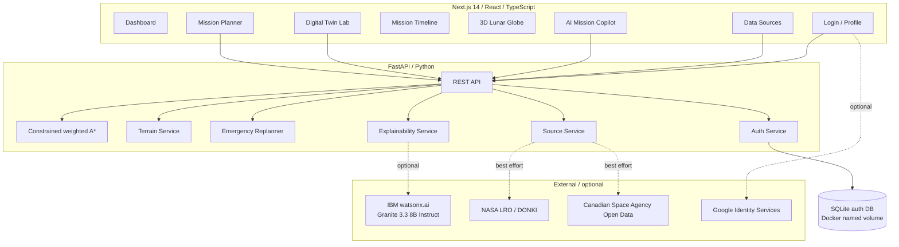

# LunaGuard Architecture

## Design goal

LunaGuard separates **safety-relevant deterministic computation** from **generative mission intelligence**. A route can be planned, scored, rejected, reassessed, and audited without a language model.

## System map



## Frontend organization

The old single-page mission console remains intact as `/planner`. New workflows are separate routes so the interface reads like a product rather than one long hackathon page:

```text
/               dashboard
/planner        mission planning + live execution
/timeline       decision/audit timeline
/digital-twin   failure + recovery simulation
/globe          interactive lunar globe
/copilot        IBM Granite grounded chat
/data           source/provenance center
/login          local + optional Google login
/profile        operator session profile
```

A global `AppShell` provides the LunaGuard navigation, logo, IBM AI status language, and session controls. `/login` intentionally renders without the shell.

## Deterministic planning boundary

The planner and emergency service own:

- route geometry,
- traversability,
- maximum-slope constraints,
- energy use,
- battery reserve,
- hazard/risk,
- viability,
- recovery recommendation inputs.

These values are computed before any LLM call.

## IBM Granite boundary

`backend/app/api/ai.py` exposes:

- `/api/ai/brief` for route-evidence narration,
- `/api/ai/copilot` for source-grounded mission Q&A.

When `WATSONX_API_KEY` and `WATSONX_PROJECT_ID` are configured, `ModelInference` calls the configured Granite model through watsonx.ai. If unavailable, the API returns a labeled deterministic fallback.

The Copilot prompt requires source IDs, prohibits invented telemetry/numerical safety claims, and distinguishes source facts from inference.

## Source service

`SourceService` combines curated authoritative metadata with short-timeout live calls:

- NASA LRO / LOLA science-data references,
- NASA LRO data-products / PDS pathway,
- NASA DONKI recent space-weather notifications,
- Canadian Space Agency LEAD rover-analogue data,
- CSA CKAN open-data search.

Network failure never prevents route planning.

## Digital Twin

The browser simulation provides dynamic telemetry visualization, but route/recovery decisions still come from the FastAPI backend:

1. `planRoutes(DEMO_MISSION)`
2. animate the recommended route
3. inject a selected anomaly around 48%
4. `reassessRoute(...)` from the current rover position
5. display recovery evidence
6. if `FOLLOW_RECOVERY_ROUTE` is viable, animate the recovery path to completion
7. append planning/anomaly/recovery/completion events to the Mission Timeline

This makes the demo repeatable without pretending to be a high-fidelity rover physics model.

## Timeline

The prototype Mission Timeline is browser-local storage plus a custom browser event. It demonstrates an audit UX, not a production audit database. A production version should move events to append-only server persistence with identity, signatures, retention controls, and mission timestamps.

## Authentication

Prototype local auth:

- PBKDF2-HMAC-SHA256 passwords with per-user salts,
- hashed random bearer session tokens,
- 7-day session expiry,
- SQLite persistence in `lunaguard_auth` Docker volume.

Optional Google sign-in verifies the Google ID credential server-side and checks the configured audience.

Production should use managed identity/OIDC, secure HTTP-only cookies, MFA/RBAC, rate limiting, account lifecycle management, and centralized audit logging.

## Data boundary

Current route-planning terrain: **synthetic deterministic demo data**.

Current globe: **generated visual proxy layers** designed to demonstrate UX; not raw NASA imagery.

Current Copilot source knowledge: source summaries and best-effort live NASA/CSA records.

The architecture is intentionally modular so validated mission DEMs, imagery tiles, rover telemetry, and uncertainty products can be added later without changing the human/AI decision boundary.
